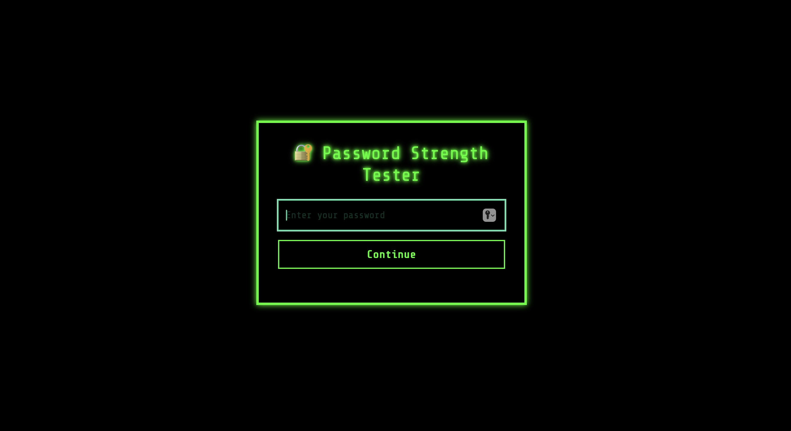
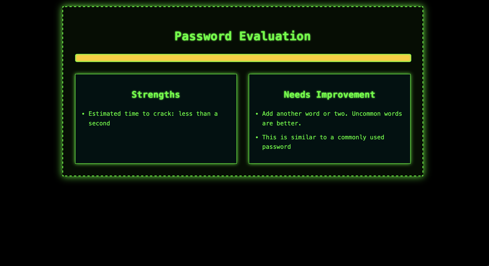

# KeySentinel — Password Strength Tester (Mini Project)

## 📌 Overview
This is a **simple password strength tester mini project** built in my free time.  
It analyzes password strength using the **zxcvbn** library and shows:

✅ Strength score (0–4)  
✅ Estimated time needed to crack the password  
✅ Suggestions to improve password security  
✅ Fully client-side — no password upload

---

## 🖥️ Screenshots
### Input View


### Output View


---

## 🚀 Features
- Built using **HTML**, **CSS**, and **JavaScript**
- Uses **zxcvbn** for crack-time estimation
- Clean and informative UI
- Real-time feedback
- Beginner-friendly project structure

---


---

## ▶️ How to Run
No installation needed.

Just clone the repo and open `index.html` in your browser:

```bash
git clone https://github.com/<your-username>/<your-repo>.git
cd <your-repo>
open index.html   # or double-click index.html

